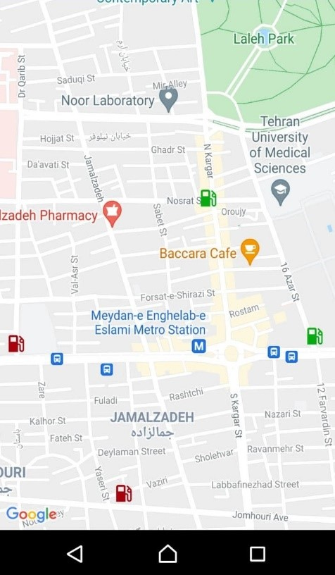

# GAIGS, A GeoBased Approach to reduce vehicle congestion
## About
This is a traffic congestion project that uses SSD and the haar cascade approach to track traffic in fuel stations.
This model is extremely fast, reaching over 120 frames per second on the NVIDIA GEFORCE 750M, and has a postprocessing accuracy of over 70%.

## How to use
1- clone files in the location you want
2- With any editor, edit ps1.py. Replace the addresses of all video files in the file with your own.
3- Simulate and run an Android app at the same time. Run the python code once the app is up and running.
4- You should edit the Android app to change the location of gas stations (add or remove).

## Screenshots of results
</img> 
The fuel station icon will turn red if there are more than 15 vehicles in line. If there are between 6 and 15 vehicles in line, the gasoline stations will be indicated in yellow, and if there are less than 6 vehicles in line, the fuel stations will be shown in green.
